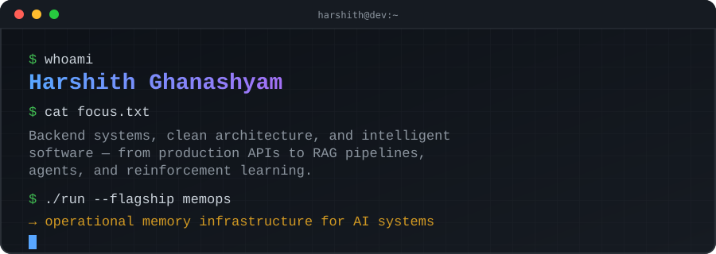

<div align="center">



<br/>

<a href="mailto:harshithghanashyam@gmail.com"></a>
&nbsp;
<a href="https://github.com/HarshithGhanashyam"></a>

<br/><br/>


</div>

---

<div align="center">

`SYSTEMS`　·　`MEMOPS`　·　`PROJECTS`　·　`ARCHITECTURE`　·　`STACK`　·　`ACTIVITY`

</div>

---

# `01` / SYSTEM PROFILE

<table width="100%">
<tr>
<td width="25%" align="center" valign="top">

### BACKEND

**APIs**  
**Services**  
**Data systems**

</td>
<td width="25%" align="center" valign="top">

### ARCHITECTURE

**Boundaries**  
**Dependencies**  
**Verification**

</td>
<td width="25%" align="center" valign="top">

### INTELLIGENCE

**RAG**  
**Agents**  
**RL**

</td>
<td width="25%" align="center" valign="top">

### VISION

**Detection**  
**Tracking**  
**Recognition**

</td>
</tr>
</table>

<div align="center">

> **The direction is deliberate: move from isolated models toward complete, auditable systems.**

</div>

---

# `02` / FLAGSHIP — MEMOPS

<div align="center">

## MEMOPS

### Operational memory infrastructure for AI and production systems.

<a href="https://github.com/HarshithGhanashyam/aioops"></a>

</div>

<br/>

<table width="100%">
<tr>
<td width="50%" valign="top">

### THE PROBLEM

Operational knowledge — incident resolutions, root causes, configuration decisions — scatters across tools, decays, contradicts itself, and becomes unreliable when it is needed.

### THE SYSTEM

A **multi-tenant REST API + CLI** for storing, versioning, retrieving, and diagnosing operational memories, with evidence and provenance attached to entries.

</td>
<td width="50%" valign="top">

### SYSTEM PIPELINE

```text
┌───────────────────────────────┐
│ INCIDENTS · FIXES · DECISIONS │
└───────────────┬───────────────┘
                ▼
        ┌───────────────┐
        │   MEMOPS API  │
        └───────┬───────┘
                ▼
        ┌───────────────┐
        │ MEMORY ENGINE │
        └───────┬───────┘
          ┌──────┼──────┐
          ▼      ▼      ▼
      RETRIEVE  STATE  DIAGNOSE
          └──────┼──────┘
                 ▼
       PostgreSQL + pgvector
```

</td>
</tr>
</table>

### `HYBRID RETRIEVAL`

<div align="center">

| VECTOR | LEXICAL | DECAY | ENVIRONMENT | LIFECYCLE |
|:---:|:---:|:---:|:---:|:---:|
| similarity | match | confidence | fingerprint | state |
| `01` | `02` | `03` | `04` | `05` |

**5 signals → hybrid ranking → relevant operational memory**

</div>

### `MEMORY LIFECYCLE`

<div align="center">

```text
PROPOSED
   │
   ▼
CONFIRMED
   │
   ├──────────────► SUPERSEDED
   │
   ├──────────────► CONTRADICTED
   │
   └──────────────► ARCHIVED
```

</div>

<table width="100%">
<tr>
<td width="25%" valign="top"><b>DIAGNOSIS</b><br/>Deterministic<br/>Zero LLM dependency<br/>Fully auditable</td>
<td width="25%" valign="top"><b>ACCESS</b><br/>Scoped API keys<br/>RBAC<br/>Rate limiting</td>
<td width="25%" valign="top"><b>VERIFICATION</b><br/>Unit tests<br/>Integration tests<br/>E2E tests · CI-gated</td>
<td width="25%" valign="top"><b>OBSERVABILITY</b><br/>OpenTelemetry<br/>Evidence<br/>Provenance</td>
</tr>
</table>

<div align="center">

`FastAPI` `PostgreSQL` `pgvector` `SQLAlchemy` `OpenTelemetry` `Poetry` `Docker`

</div>

---

# `03` / SELECTED SYSTEMS

<table width="100%">
<tr>
<td width="50%" valign="top">

### `01` / AUTONOMOUS RESEARCH AGENT

**ReAct-style research agent coordinating five tools.**

```text
INPUT
  ↓
REASON ←──────────────┐
  ↓                   │
TOOL → OBSERVATION ───┘
  ↓
ANSWER
```

Deterministic core planning. Zero API keys. LLM swap-in is isolated to one function.

`FastAPI` `Python` `ReAct`

<a href="https://github.com/HarshithGhanashyam/05-agentic-research-agent">→ repository</a>

</td>
<td width="50%" valign="top">

### `02` / VISUAL INTELLIGENCE

**Real-time video pipeline.**

```text
CAMERA
  ↓
YOLO DETECTION
  ↓
PERSON TRACKING
  ↓
FACE RECOGNITION
  ↓
INCIDENT LOG
```

Turns live video into searchable incidents.

`YOLO` `InsightFace` `OpenCV` `FastAPI`

<a href="https://github.com/HarshithGhanashyam/surveillance-project">→ repository</a>

</td>
</tr>
<tr>
<td width="50%" valign="top">

### `03` / PDF RAG

**Local retrieval pipeline with cited answers.**

```text
PDF → CHUNK → LSA → FAISS → RERANK → CITED ANSWER
```

No hosted vector database required.

`FAISS` `LSA` `pypdf` `Streamlit`

<a href="https://github.com/HarshithGhanashyam/06-rag-pdf-chatbot">→ repository</a>

</td>
<td width="50%" valign="top">

### `04` / Q-LEARNING

**Tabular Q-learning from scratch.**

```text
STATE → ACTION → REWARD → Q UPDATE → POLICY
  ↑                                      │
  └──────────────────────────────────────┘
```

Implemented without an RL library using NumPy.

`Python` `NumPy` `Streamlit`

<a href="https://github.com/HarshithGhanashyam/08-rl-learning-agent">→ repository</a>

</td>
</tr>
</table>

### PROJECT ARCHIVE

| # | SYSTEM | FOCUS | REPOSITORY |
|---:|---|---|---|
| `01` | **Customer Churn Dashboard** | Classification + analytics | [→ repo](https://github.com/HarshithGhanashyam/01-churn-dashboard) |
| `02` | **CNN Image Classifier** | Deep learning | [→ repo](https://github.com/HarshithGhanashyam/02-cnn-image-classifier) |
| `03` | **GAN Digit Generator** | Generative models | [→ repo](https://github.com/HarshithGhanashyam/03-gan-digit-generator) |
| `04` | **LLM Summarizer / QA** | LLM integration | [→ repo](https://github.com/HarshithGhanashyam/04-llm-summarizer-qa) |
| `07` | **OpenCV Detection Suite** | Computer vision | [→ repo](https://github.com/HarshithGhanashyam/07-opencv-detection-suite) |

---

# `04` / ENGINEERING MODEL

<div align="center">

### FROM MODELS → TO SYSTEMS → TO INFRASTRUCTURE

```text
┌────────────┐
│   MODELS   │
└─────┬──────┘
      ↓
┌────────────┐
│ AI         │
│ COMPONENTS │
└─────┬──────┘
      ↓
┌────────────┐
│INTELLIGENT │
│APPLICATIONS│
└─────┬──────┘
      ↓
┌────────────┐
│ AGENTS +   │
│ RETRIEVAL  │
└─────┬──────┘
      ↓
┌────────────┐
│  SYSTEMS   │
└─────┬──────┘
      ↓
┌────────────────┐
│ AI INFRASTRUCTURE │
└───────┬────────┘
        ↓
      MEMOPS
```

</div>

### ARCHITECTURE PRINCIPLE

<div align="center">

```text
DOMAIN → APPLICATION → INFRASTRUCTURE → INTERFACE → AGENTS
  │
  └─────────────── dependencies stay controlled ────────────────┘
```

</div>

> **Core behavior should not become a hostage to frameworks, databases, models, or external APIs.**

---

# `05` / TECHNOLOGY

<div align="center">

<table width="90%">
<tr><td><b>LANGUAGES</b></td><td>Python · TypeScript · JavaScript · C · Java</td></tr>
<tr><td><b>BACKEND</b></td><td>FastAPI · Flask · REST</td></tr>
<tr><td><b>DATA</b></td><td>PostgreSQL · pgvector · SQLite · MySQL</td></tr>
<tr><td><b>AI / ML</b></td><td>PyTorch · scikit-learn · NumPy</td></tr>
<tr><td><b>INTELLIGENT SYSTEMS</b></td><td>RAG · Agents · LLM Integration · Reinforcement Learning</td></tr>
<tr><td><b>VISION</b></td><td>OpenCV · YOLO · InsightFace</td></tr>
<tr><td><b>INFRASTRUCTURE</b></td><td>Docker · OpenTelemetry · Poetry · Git · GitHub</td></tr>
</table>

<br/>


</div>

---

# `06` / ACTIVITY

<div align="center">

<!-- Generated by metrics.yml -->


<br/>


&nbsp;


<br/><br/>

<!-- Generated by snake.yml -->


</div>

---

<div align="center">


### SYSTEM STATUS

`● BUILDING`

**CURRENT FOCUS — MEMOPS**

Operational memory infrastructure for AI systems.

<br/>

<a href="mailto:harshithghanashyam@gmail.com">harshithghanashyam@gmail.com</a>
&nbsp; · &nbsp;
<a href="https://github.com/HarshithGhanashyam">github.com/HarshithGhanashyam</a>

<br/><br/>

`SYSTEMS` · `ARCHITECTURE` · `AI ENGINEERING`

</div>
